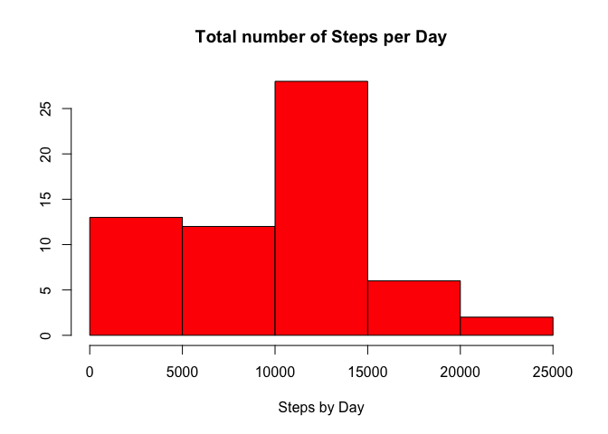
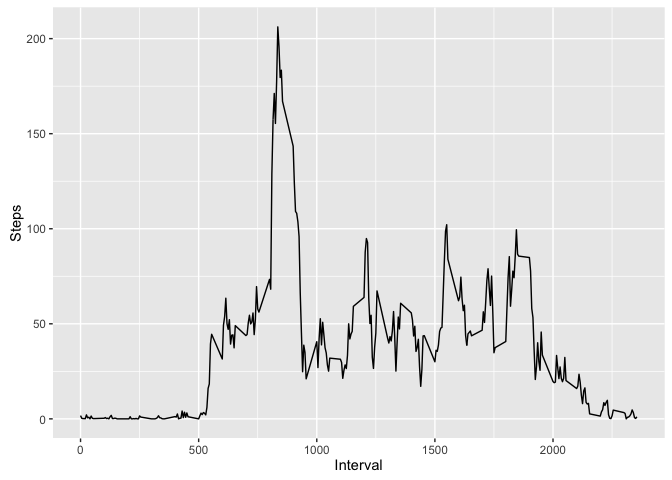
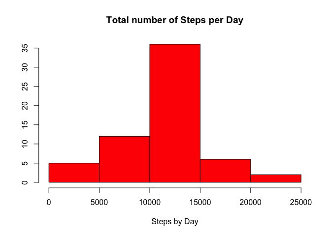
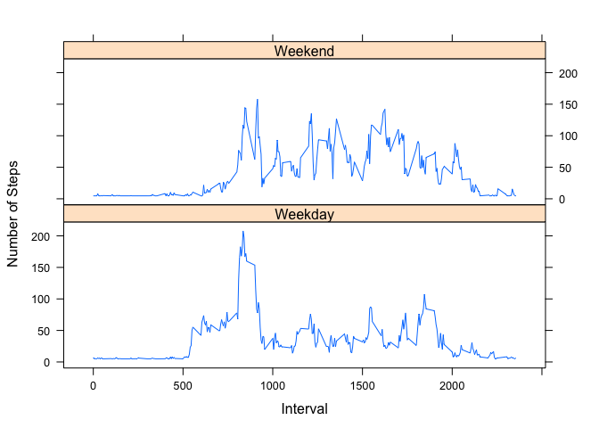

# Activity Tracker Analysis

Reading in the Activity Data:

```r
library(ggplot2)
activitydata<- read.csv("activity.csv", na.strings = "NA", stringsAsFactors = FALSE)
activitydata$date <- as.POSIXlt(activitydata$date, format="%Y-%m-%d")
```


##What is mean total number of steps taken per day?
###Ignoring the missing values in the dataset.


```r
stepsbyday <- aggregate(activitydata$steps, by=list(Date=as.character(activitydata$date)), sum, na.rm=TRUE)
names(stepsbyday) = c("Day", "Steps")
```
The total number of steps taken per day is:


```r
sum(stepsbyday$Steps)
```

```
## [1] 570608
```

```r
meanstepsbyday <- mean(stepsbyday$Steps)
medianstepsbyday <- median(stepsbyday$Steps)
```

###Histogram of the total number of steps taken each day


```r
hist(stepsbyday$Steps, col = "red", xlab = "Steps by Day", ylab = "", main = "Total number of Steps per Day")
```

 

The mean of the total number of steps taken per day are:


```r
meanstepsbyday
```

```
## [1] 9354.23
```
The median of the total number of steps taken per day are:


```r
medianstepsbyday
```

```
## [1] 10395
```

##What is the average daily activity pattern?

###Time Series Plot of the 5 minute interval and avg steps across all days


```r
averagestepsbyinterval <- aggregate(activitydata$steps, by=list(Interval=activitydata$interval), mean, na.rm=TRUE)
names(averagestepsbyinterval) <- c("Interval", "Steps")
qplot(Interval, Steps, data=averagestepsbyinterval, geom = "line")
```

 

```r
intervalformaxsteps <- averagestepsbyinterval[ max(averagestepsbyinterval$Steps) == averagestepsbyinterval$Steps, ]
```
The 5 minute interval containing the maximum number of steps averaged across all the days is:

```r
intervalformaxsteps
```

```
##     Interval    Steps
## 104      835 206.1698
```

##Imputing missing values

Note that there are a number of days/intervals where there are missing values (coded as NA). The presence of missing days may introduce bias into some calculations or summaries
of the data.

The total number of missing values in the dataset is:

```r
imputed_data <- data.frame(activitydata)
sum(is.na(imputed_data$steps))
```

```
## [1] 2304
```

```r
meanperinterval <- mean(imputed_data$steps, na.rm=TRUE)
imputed_data[ is.na(imputed_data$steps), "steps"] <- meanperinterval

imputed_stepsbyday <- aggregate(imputed_data$steps, by=list(Date=as.character(imputed_data$date)), sum, na.rm=TRUE)
names(imputed_stepsbyday) = c("Day", "Steps")
```

Histogram of the total number of steps taken each day with imputed values:

```r
hist(imputed_stepsbyday$Steps, col = "red", xlab = "Steps by Day", ylab = "", main = "Total number of Steps per Day")
```

 

```r
imputed_meanstepsbyday <- mean(imputed_stepsbyday$Steps)
imputed_medianstepsbyday <- median(imputed_stepsbyday$Steps)
```
The mean steps by day with imputed missing values are:


```r
imputed_meanstepsbyday
```

```
## [1] 10766.19
```
The median steps by day with imputed missing values are:


```r
imputed_medianstepsbyday
```

```
## [1] 10766.19
```
Do these values differ from the estimates from the first part of the assignment?

Yes, these values differ from the mean and median computed on the dataset where the missing values are removed.

What is the impact of imputing missing data on the estimates of the total daily number of steps?
The total daily number of steps increases when the missing values are imputed.

The total daily number of steps without missing values:

```r
sum(activitydata$steps, na.rm = TRUE)
```

```
## [1] 570608
```
The total daily number of steps with imputed missing values:

```r
sum(imputed_data$steps)
```

```
## [1] 656737.5
```
##Are there differences in activity patterns between weekdays and weekends?


```r
weekend <- (weekdays(imputed_data$date) == "Sunday") | (weekdays(imputed_data$date) == "Saturday")
imputed_data$daysofweek <- factor(ifelse(weekend,"Weekend","Weekday"))

imputed_stepsbyweekday <- aggregate(imputed_data$steps, by=list(DayType=imputed_data$daysofweek, Interval=imputed_data$interval), mean)
```
###Time series plot of the 5-minute interval and the average number of steps taken, averaged across all weekday days or weekend days. 


```r
library(lattice)
xyplot(imputed_stepsbyweekday$x~imputed_stepsbyweekday$Interval|imputed_stepsbyweekday$DayType, layout = c(1,2), type="l", xlab = "Interval", ylab = "Number of Steps")
```

 

